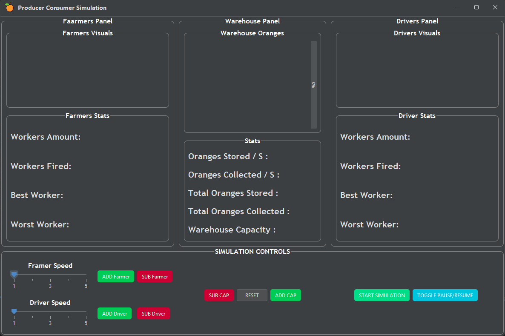
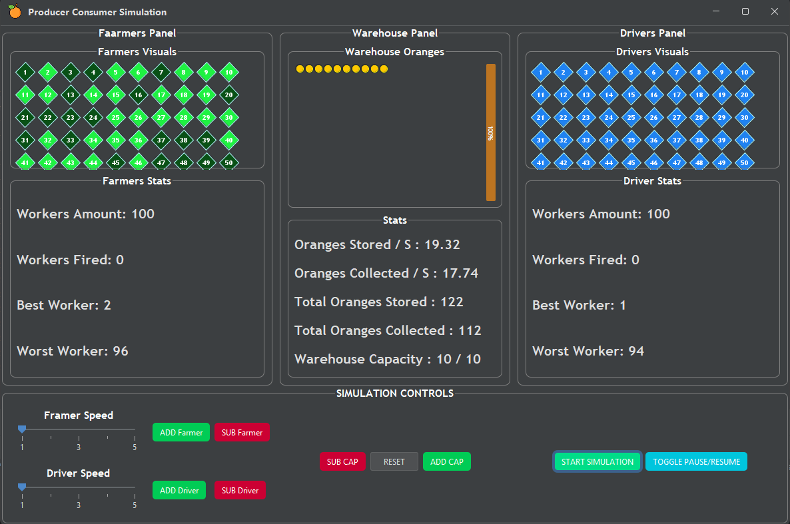

# Consumer Producer Simulation 🍊

## 👋 Hello, World :D

### 🧵 Producer-Consumer Problem

At its heart, this simulation is a practical implementation of the classic **Producer-Consumer multi-threading problem**, framed within a digital orange supply chain.

To prevent data corruption, our background threads are carefully synchronized to cooperate safely:
*   **The Producers (Farmers):** Active background threads that harvest 🍊 oranges and push them into the warehouse storage.
*   **The Buffer (Warehouse):** The shared memory space with strict capacity limits. If it fills up, farmers must patiently wait; if it empties, drivers have to wait for the next harvest.
*   **The Consumers (Drivers):** Continuous threads responsible for pulling 🍊 oranges out of the warehouse to transport them away.

**Why this matters:** Without proper thread synchronization, farmers and drivers would clash over the warehouse data at the exact same millisecond. This leads to classic race conditions, inventory miscounts, or immediate application crashes.

To keep things stable, our synchronization logic acts as the mediator to ensure total safety across the shared supply chain.

---
## 🚀 Simulation Features
*   **Warehouse Capacity:** Adjust the storage capacity up or down, or reset it back to default.
*   **Worker Management:** Add or remove workers, and change their work speed with a slider.
*   **Pause & Resume:** Freeze and continue the simulation logic. <small><kbd>WIP: Needs further testing <small>(Works on our machines 🙃)</small></kbd></small>

---
## ▶️ How To Start ?

### 🛠️ Setup Steps

1. **Get the Code:**
    * **Option A (The Developer Way):** Copy the repository URL from the green <kbd style="background-color: #238636; color: #ffffff; padding: 3px 8px; border: 1px solid rgba(240,246,252,0.1); border-radius: 6px; font-weight: 600; font-size: 12px;"><> Code ▾</kbd> button at the top right of this page, then clone it via your terminal: `git clone https://github.com/Sergey2334/CSY1SB-Task1-Threads`
    * **Option B (The Quick Way):** Click the green <kbd style="background-color: #238636; color: #ffffff; padding: 3px 8px; border: 1px solid rgba(240,246,252,0.1); border-radius: 6px; font-weight: 600; font-size: 12px;"><> Code ▾</kbd> button at the top right of this page and select **Download ZIP**, then extract the files.

2. **Open the Project:**
    * Launch your favorite IDE (IntelliJ IDEA, Eclipse, or NetBeans).
    * Open or import the extracted project folder.

   

    


3. **Initialize the App:**
    * Navigate to the `Root` folder and run the `Main` class to pull up the environment interface.

---

## 🕹️ Running the Simulation

To kick off the operational workflow, look for and press the button below in the application window:

<kbd style="background-color: #00DD88; color: #ffffff; padding: 7px 14px; border: none; border-radius: 10px; font-weight: bold; font-size: 11px; letter-spacing: 1px;">
START SIMULATION
</kbd>

*Once pressed, the multithreaded logistics loop will initialize immediately.*




### 🖥️ UI Layout & Controls
The interface is split into three simple columns, with the controls placed directly below their matching visual panels.

| Section | Left (Farmers) | Center (Warehouse) | Right (Drivers) |
| :--- | :--- | :--- | :--- |
| **Visuals & Stats** | • Worker status (active/idle)<br>• Live farmer stats | • Orange inventory flow<br>• Warehouse metrics | • Driver status (active/idle)<br>• Live driver stats |
| **Available Controls** | • Population (+ / -)<br>• Speed adjustment sliders | • Capacity (+1 / -1)<br>• Reset capacity button | • Start simulation<br>• Pause / Resume toggle |
---
## How It Works ?

### 🎮 The Supreme Orchestrator (`SupplyChainManager`)

The `SupplyChainManager` acts as the system Controller, mapping user inputs directly to our execution pipelines.

*   **Multi-Threaded Ignition:** When launched, this manager spins up four concurrent pipelines to drive the simulation:
    ```java
    Thread warehouseThread = new Thread(this.warehouseManager);
    Thread farmersThread = new Thread(this.farmersManager);
    Thread driversThread = new Thread(this.driversManager);
    Thread simulationVisualsThread = new Thread(this.simulationVisualManager);
    ```
*   **The Core Problem Solver (`WarehouseManager`):** This is where the actual multi-threading problem is solved. Using `synchronized` blocks alongside `wait()` and `notifyAll()` ensures that threads cooperate efficiently without causing resource deadlocks:
    ```java
    public synchronized void add() throws InterruptedException {
        while (this.warehouse.getIsFull()) {
            wait(); // Farmer thread safely pauses at 0% CPU if full
        }
        this.warehouse.add();
        this.orangesStored.incrementAndGet();
        notifyAll(); // Wakes up waiting drivers safely
    }

    public synchronized void remove() throws InterruptedException {
        while (this.warehouse.getIsEmpty()) {
            wait(); // Driver thread safely pauses at 0% CPU if empty
        }
        this.warehouse.remove();
        this.orangesCollected.incrementAndGet();
        notifyAll(); // Wakes up waiting farmers safely
    }
    ```
    
*   **The `while` Loop Guard (Crucial Safety Feature):** Notice we use a `while` condition instead of a simple `if` block before calling `wait()`. This forces threads to re-verify the warehouse boundaries immediately after waking up. It effectively guards our program against data corruption caused by unexpected thread context switches or spurious wakeups. 
*(Arguably the most critical piece of logic in the entire simulation. Special thanks to Aviya for the insight!)*

---
## Project Structure & Architecture
### 🏗️ How it's Built: The MVC Breakdown

This project is built using the **MVC (Model-View-Controller) pattern**. Instead of throwing all the code into one giant file, everything is split into three clean parts so it's easy to read, tweak, and upgrade.

*   **Model (The Brains):** This is where all the data lives and the actual logic happens. It tracks the simulation state, manages the workers, and knows what's going on behind the scenes—completely independent of how things look on screen.
*   **View (The Face):** This handles everything the user sees. It builds the windows, layouts, and panels (like your stats readouts and warehouse storage). It is purely visual and just waits for instructions on what data to display.
*   **Controller (The Link):** This sits right in the middle acting as the director. When a user clicks a button, drags a speed slider, or toggles pause, the Controller catches that input, tells the Model what to change, and ensures the View updates smoothly.

### 📁 Project Architecture
<details>
  <summary>📂 <b>Main</b></summary>
  <br>
  <ul>
    <li>📂 <b>java</b>
      <ul>
        <li>📂 <b>Root</b>
          <ul>
            <!-- CONTROLLER -->
            <li>
              <details>
                <summary>📂 <b>Controller</b></summary>
                <ul>
                  <li>📄 SimulationControls.java</li>
                  <li>📄 SupplyChainManager.java</li>
                  <li>📄 WorkerFactory.java (Interface)</li>
                  <li>📄 WorkerManager.java</li>
                </ul>
              </details>
            </li>
            <!-- CORE -->
            <li>
              <details>
                <summary>📂 <b>Core</b></summary>
                <ul>
                  <li>📄 Constants.java (Final)</li>
                  <li>📄 MyUtils.java (Final)</li>
                  <li>📄 WarehouseAction.java (Interface)</li>
                </ul>
              </details>
            </li>
            <!-- MODEL -->
            <li>
              <details>
                <summary>📂 <b>Model</b></summary>
                <ul>
                  <li>📄 Driver.java</li>
                  <li>📄 Farmer.java</li>
                  <li>📄 SimulationVisualManager.java</li>
                  <li>📄 Warehouse.java</li>
                  <li>📄 WarehouseManager.java</li>
                  <li>📄 Worker.java (Abstract)</li>
                </ul>
              </details>
            </li>
            <!-- VIEW -->
            <li>
              <details>
                <summary>📂 <b>View</b></summary>
                <ul>
                  <li>
                    <details>
                      <summary>📂 <b>MainWindow</b></summary>
                      <ul>
                        <li>📄 MainWindow.java</li>
                      </ul>
                    </details>
                  </li>
                  <li>
                    <details>
                      <summary>📂 <b>SimulationArea</b></summary>
                      <ul>
                        <li>📄 SimulationArea.java</li>
                        <li>
                          <details>
                            <summary>📂 <b>DriversPanel</b></summary>
                            <ul>
                              <li>📄 DriversPanel.java</li>
                              <li>📄 DriversStats.java</li>
                              <li>📄 DriversVisuals.java</li>
                            </ul>
                          </details>
                        </li>
                        <li>
                          <details>
                            <summary>📂 <b>FarmersPanel</b></summary>
                            <ul>
                              <li>📄 FarmersPanel.java</li>
                              <li>📄 FarmersStats.java</li>
                              <li>📄 FarmersVisuals.java</li>
                            </ul>
                          </details>
                        </li>
                        <li>
                          <details>
                            <summary>📂 <b>WarehousePanel</b></summary>
                            <ul>
                              <li>📄 WarehousePanel.java</li>
                              <li>📄 WarehouseStats.java</li>
                              <li>📄 WarehouseStorage.java</li>
                            </ul>
                          </details>
                        </li>
                      </ul>
                    </details>
                  </li>
                  <li>
                    <details>
                      <summary>📂 <b>SimulationControlsArea</b></summary>
                      <ul>
                        <li>📄 SimulationControlsArea.java</li>
                        <li>
                          <details>
                            <summary>📂 <b>AddSubResetArea</b></summary>
                            <ul>
                              <li>📄 AddSubResetPanel.java</li>
                            </ul>
                          </details>
                        </li>
                        <li>
                          <details>
                            <summary>📂 <b>ControlsUtils</b></summary>
                            <ul>
                              <li>📄 SimulationControlsButton.java</li>
                            </ul>
                          </details>
                        </li>
                        <li>
                          <details>
                            <summary>📂 <b>SlidersArea</b></summary>
                            <ul>
                              <li>📄 SliderPanel.java</li>
                              <li>📄 WorkerSpeedSlider.java</li>
                            </ul>
                          </details>
                        </li>
                        <li>
                          <details>
                            <summary>📂 <b>StartPauseResumeArea</b></summary>
                            <ul>
                              <li>📄 StartPauseResumePanel.java</li>
                            </ul>
                          </details>
                        </li>
                      </ul>
                    </details>
                  </li>
                  <li>
                    <details>
                      <summary>📂 <b>ViewUtils</b></summary>
                      <ul>
                        <li>📄 ViewUtils.java (Final)</li>
                      </ul>
                    </details>
                  </li>
                </ul>
              </details>
            </li>
          </ul>
        </li>
      </ul>
    </li>
    <br>
    <li><code>Main</code> <kbd>⬅️ Start Here :D</kbd></li>
  </ul>
</details>

---
## 👋 Goodbye World :D

This simulation was a fantastic learning experience. It taught us a lot about thread safety, resource management, and how remarkably easy it is to spike a CPU to 100% and freeze a computer with just a poorly placed while loop.

**We hope you enjoy exploring this simulation! If our synchronization logic holds up, your PC shouldn't crash. (Key word: *Shouldn't*...) 🙃**

---
<div align="right">

[Back To Top ⬆️](#-hello-world-d)

</div>